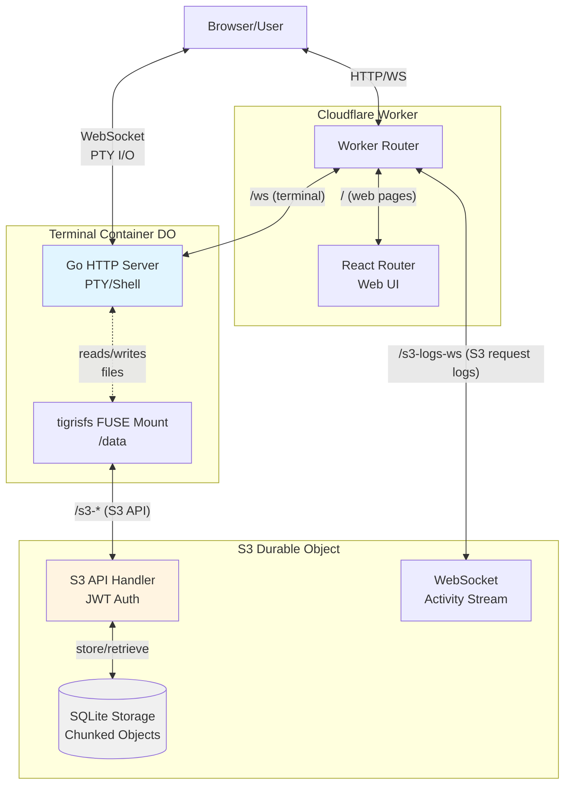

# DO-S3

A Cloudflare Container that uses a Durable Object for persistent storage. The `/data` directory is a FUSE mount that connects to a Durable Object over an [S3 API](https://github.com/maxmcd/do-s3/blob/main/worker/s3.ts).

## Architecture

## How It Works

1. **Web UI**: React Router frontend served by Cloudflare Worker
2. **Terminal Container**: Go server running in a Cloudflare Container with:
   - WebSocket-based PTY for terminal access
   - FUSE filesystem mounted at `/data` using tigrisfs
3. **S3 Durable Object**: Custom S3-compatible API that:
   - Stores objects in SQLite (chunked for large files)
   - Uses JWT for authentication/authorization
   - Broadcasts request activity via WebSocket
